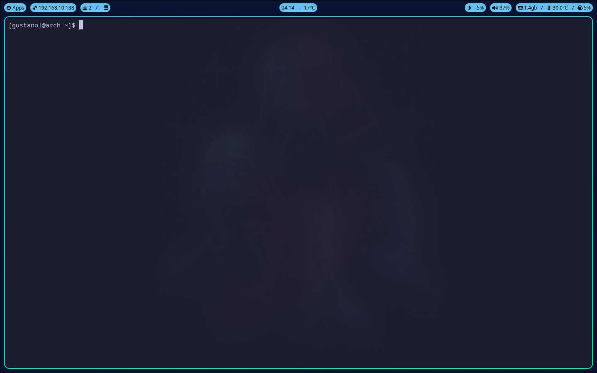
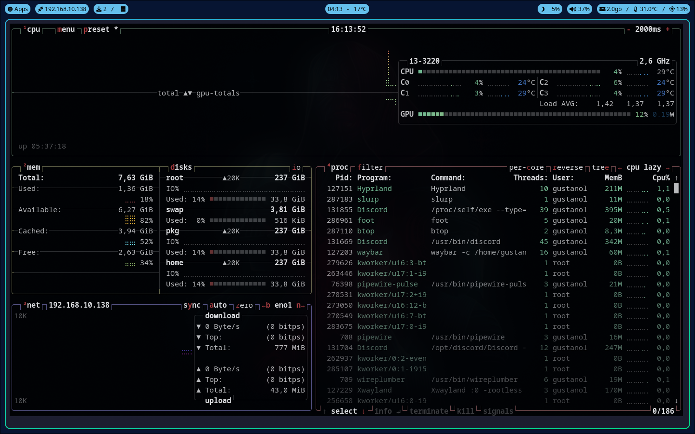
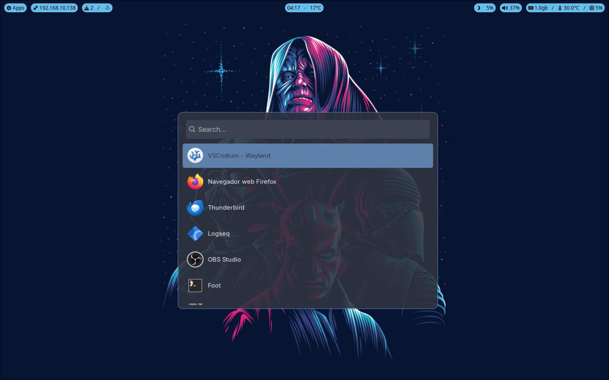
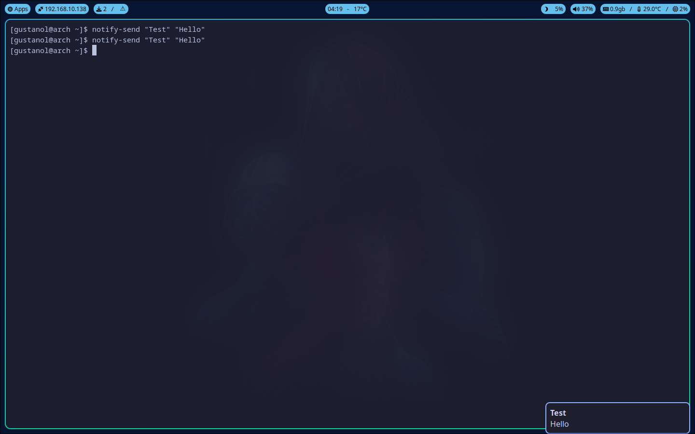
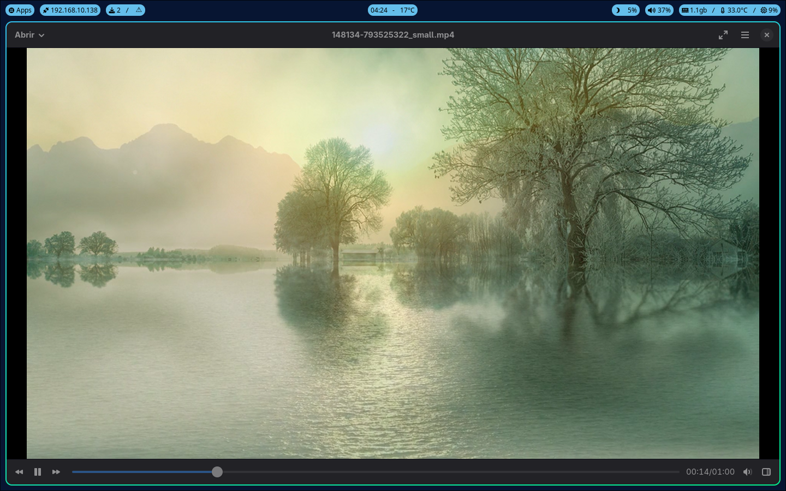

# My Arch-based distros dotfiles

In this repository, I can store my dotfiles configurations for my Arch Linux setup.

---

### Projects used:
- [Wayland](https://gitlab.freedesktop.org/wayland/wayland)
- [Hypr Development](github.com/hyprwm)
  - [Hyprland](https://github.com/hyprwm/Hyprland)
  - [Hyprpaper](https://github.com/hyprwm/hyprpaper)
  - [Hyprlock](https://github.com/hyprwm/hyprlock)
- [Waybar](https://github.com/Alexays/Waybar)
- [GTK](https://gitlab.gnome.org/GNOME/gtk)
- [Foot terminal emulator](https://codeberg.org/dnkl/foot)
- [Mako](https://github.com/emersion/mako)
- [MPV](https://github.com/mpv-player/mpv)
  - [Celluloid](https://github.com/celluloid-player/celluloid)
- [PipeWire](https://github.com/PipeWire/pipewire)
- [Wofi](https://github.com/SimplyCEO/wofi)
- [Thunar](https://gitlab.xfce.org/xfce/thunar)

---

### System screenshots:
<details>
  <summary>Hyprland</summary>
  <br>
</details>

<details>
  <summary>Foot</summary>
  <br><br>
  <br>
</details>

<details>
  <summary>Wofi</summary>
  <br>
</details>

<details>
  <summary>Mako</summary>
  <br>
</details>

<details>
  <summary>Celluloid</summary>
  <br>
</details>

---

### Setup the configuration

To make this configuration your dotfiles, follow this steps:

1. Clone this repository:

```bash
git clone https://github.com/Gustanol/dotfiles.com
cd dotfiles
```

2. You can manualy setup these files into its directory (e.g. `.config`). However, in the root of this repository, there's a [setup script](./setup.sh) to do this. It will install some dependencies and setup the files.
  - Give execution permission to the script:

  ```bash
  chmod +x ./setup.sh
  ```

  - Now, run it:
    - you can specify if you want to copy the files into dotfiles or create symlinks:

  ```bash
  ./setup.sh y # "y" to create symlinks
  ```

---

Enjoy! 😀